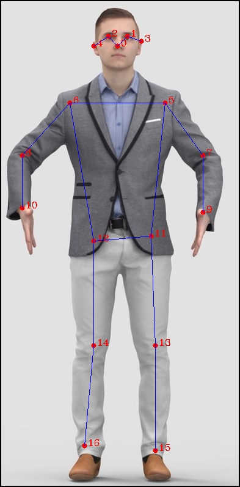

# Human-Pose-Estimation-Lite-cpp

这是轻量化版本的人体姿态估计(2D Pose)C++推理代码，推理框架使用[TNN](https://github.com/Tencent/TNN)

- 轻量化模型是基于MobileNet V2的改进版本 
- 使用COCO的数据集进行训练，也可以支持MPII数据
- 支持OpenCL模型推理加速，在普通手机可实时检测
- 该仓库并未集成`人体检测模型`，Pose检测输入是原图，使用人体检测框并进行裁剪，Pose检测效果会更好
- 关于轻量化版本的人体检测检测模型，可参考[Object-Detection-Lite-cpp](https://github.com/PanJinquan/Object-Detection-Lite-cpp)
- 仅用于学习交流，并未进行过多的性能优化
- 博客《[2D Pose人体关键点检测(Python/Android /C++ Demo)](https://panjinquan.blog.csdn.net/article/details/115765863) 》
- [Python Demo](https://github.com/PanJinquan/Human-Keypoints-Detection)  模型训练代码暂时未提供
- [Android Demo](https://download.csdn.net/download/guyuealian/24186395) 已经集成了轻量化版本的`人体检测模型`和`人体姿态估计模型`，在普通手机可实时检测

|[Android Demo](https://download.csdn.net/download/guyuealian/24186395) CPU:70ms,GPU:50ms|
|---|
||


## 1.目录结构
```
.
├── 3rdparty
├── data
├── docs
├── src
├── build.sh
├── CMakeLists.txt
├── README.md
└── result.jpg
```

## 2.配置说明
#### (1)依赖库
- TNN：https://github.com/Tencent/TNN (推理框架)
- OpenCV: https://opencv.org/releases （推荐opencv-4.3.0）
- OpenCL: https://software.intel.com/content/www/us/en/develop/tools/opencl-sdk/choose-download.html (GPU的支持)
- base-utils：https://github.com/PanJinquan/base-utils  (一些文件和图像处理的相关工具)

#### (2)配置说明

- 配置OpenCV（推荐opencv-4.3.0）
  
```bash
mkdir build
cd build
cmake -D CMAKE_BUILD_TYPE=Release -D CMAKE_INSTALL_PREFIX=/usr/local ..
sudo make install
```

- 配置OpenCL（可选）
> Android系统一般都支持OpenCL，Linux系统可参考如下配置：

```bash
# 参考安装OpenCL： https://blog.csdn.net/qq_28483731/article/details/68235383，作为测试，安装`intel cpu版本的OpenCL`即可
# 安装clinfo，clinfo是一个显示OpenCL平台和设备的软件
sudo apt-get install clinfo
# 安装依赖
sudo apt install dkms xz-utils openssl libnuma1 libpciaccess0 bc curl libssl-dev lsb-core libicu-dev
sudo apt-key adv --keyserver hkp://keyserver.ubuntu.com:80 --recv-keys 3FA7E0328081BFF6A14DA29AA6A19B38D3D831EF
echo "deb http://download.mono-project.com/repo/debian wheezy main" | sudo tee /etc/apt/sources.list.d/mono-xamarin.list
sudo apt-get update
sudo apt-get install mono-complete
# 在intel官网上下载了intel SDK的tgz文件，并且解压
sudo sh install.sh
```


## 3.模型参数说明
- 模型需要配置的参数如下：
```c++
struct ModelParam {
    float aspect_ratio;                //长宽比，一般为0.75
    float scale_ratio;                 //缩放比例，一般为1.25
    int input_width;                   //模型输入宽度，单位：像素
    int input_height;                  //模型输入高度，单位：像素
    bool use_udp;                      //是否使用无偏估计UDP,一般为false
    bool use_rgb;                      //是否使用RGB作为模型输入
    vector<float> bias;                //输入数据偏置：bias=-m/std
    vector<float> scale;               //输入数据归一化尺度：scale=1/std/255
    vector<vector<float>> skeleton;    //关键点连接序号ID(用于可视化显示)
};
```

## 4.Demo
 
- `bash build.sh`




## 5.COCO关键点说明
- 关键点连接线序号（用于绘制图像）

```python
skeleton =[[15, 13], [13, 11], [16, 14], [14, 12], [11, 12], [5, 11], [6, 12], [5, 6], [5, 7], [6, 8], [7, 9], [8, 10], [0, 1], [0, 2], [1, 3], [2, 4]]
```

- 图像左右翻转时，成对的关键点（训练时用于数据增强）

```python
flip_pairs=[[1, 2], [3, 4], [5, 6], [7, 8],[9, 10], [11, 12], [13, 14], [15, 16]]
```

- 每个关键点序号对应人体关键点的意义
```python
"keypoints": {
 0: "nose",
 1: "left_eye",
 2: "right_eye",
 3: "left_ear",
 4: "right_ear",
 5: "left_shoulder",
 6: "right_shoulder",
 7: "left_elbow",
 8: "right_elbow",
 9: "left_wrist",
 10: "right_wrist",
 11: "left_hip",
 12: "right_hip",
 13: "left_knee",
 14: "right_knee",
 15: "left_ankle",
 16: "right_ankle"
}
```

## 6.联系

- pan_jinquan@163.com
- 麻烦给个`Star`：
- 如果你觉得该帖子帮到你，还望贵人多多支持，鄙人会再接再厉，继续努力的~
